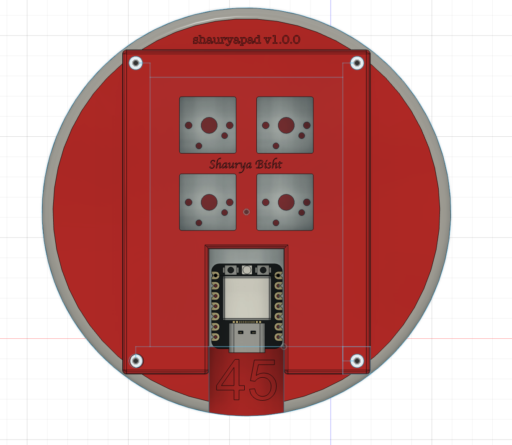
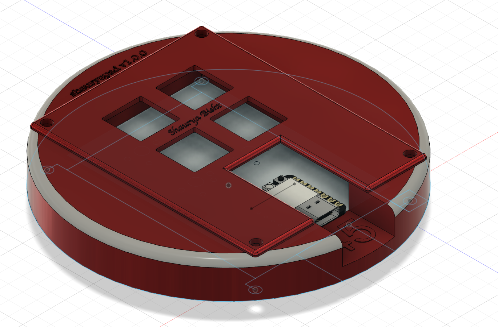
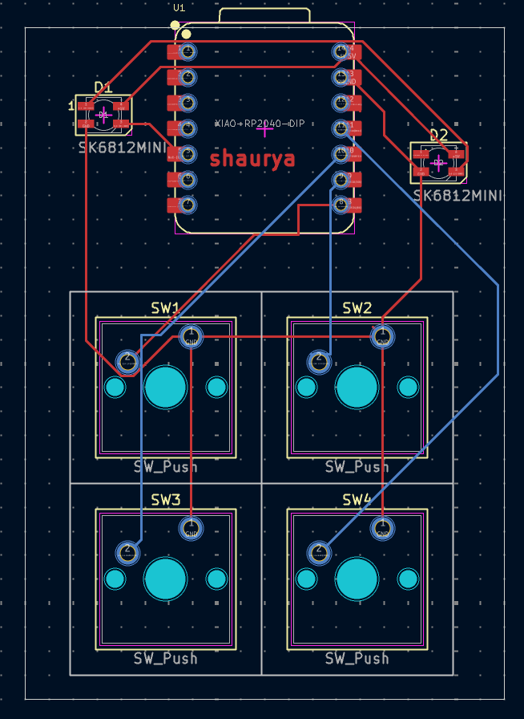
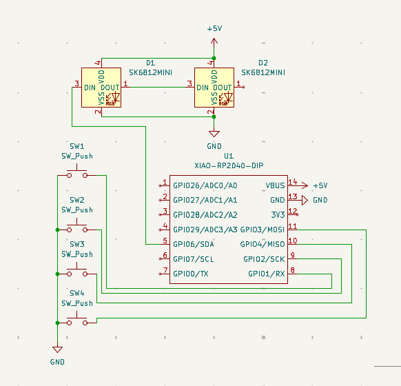

# shauryapad

a 4-key macropad that looks like a cricket ball because why not

## What is this

Basically I wanted a small macropad for media controls and thought it'd be fun to make it cricket-themed. it's got 4 keys arranged like the seam of a cricket ball and 2 RGB LEDs underneath for some flair.

Runs on a Seeed XIAO RP2040 with KMK firmware (CircuitPython-based). Super easy to reprogram without reflashing.

## Hardware

- **MCU**: Seeed XIAO RP2040
- **Switches**: 4x Cherry MX compatible switches
- **LEDs**: 2x SK6812 RGB LEDs

the PCB is designed in KiCad and shaped like a cricket ball (well, as close as you can get with a PCB).

## Default keymap

- **SW1** (top left): Play/Pause
- **SW2** (top right): Next Track
- **SW3** (bottom left): Toggle LEDs
- **SW4** (bottom right): Cycle RGB animations

## Programming

It's running KMK so you just edit `kmk/main.py` and save it to the CIRCUITPY drive. No compiling, no flashing tools, just plug it in and go.

The code's pretty straightforward if you want to change the keys or add macros. Check out the [KMK docs](https://github.com/KMKfw/kmk_firmware) for more info.

## BOM

4x Cherry MX Switches
2x SK6812 MINI LEDs
1x XIAO RP2040
4x Blank DSA Keycaps
4x M3x16 Bolts
4x M3 Heatset Inserts
~100g PLA

## Building one

All the files are here:
- `/pcb` - KiCad files for the PCB
- `/cad` - 3D models (if you want a case or something)
- `/kmk` - firmware code

Order the PCB from JLCPCB or wherever, solder on the components, flash CircuitPython and KMK to the XIAO, and you should be done.

## Final Thoughts

Honestly just thought it'd look cool. The red PCB with the white seam pattern turned out pretty nice.
